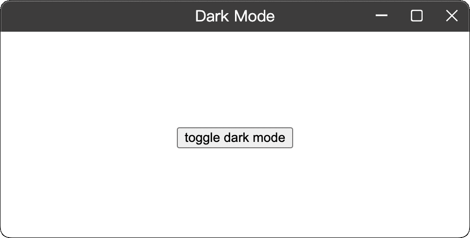

# electron-windows-titlebar

---

[![NPM version][npm-image]][npm-url]
[![CI][CI-image]][CI-url]
[![node version][node-image]][node-url]
[![npm download][download-image]][download-url]

[npm-image]: https://img.shields.io/npm/v/electron-windows-titlebar.svg
[npm-url]: https://npmjs.org/package/electron-windows-titlebar
[CI-image]: https://github.com/electron-modules/electron-windows-titlebar/actions/workflows/ci.yml/badge.svg
[CI-url]: https://github.com/electron-modules/electron-windows-titlebar/actions/workflows/ci.yml
[node-image]: https://img.shields.io/badge/node.js-%3E=_16-green.svg
[node-url]: http://nodejs.org/download/
[download-image]: https://img.shields.io/npm/dm/electron-windows-titlebar.svg
[download-url]: https://npmjs.org/package/electron-windows-titlebar

> windows-style title bar component for Electron

## Native Addon Demo

<p align="center">
  
</p>

## Web API Demo

<p align="center">
  
</p>


<!-- GITCONTRIBUTOR_START -->

## Contributors

|[<br/><sub><b>xudafeng</b></sub>](https://github.com/xudafeng)<br/>|[<br/><sub><b>sriting</b></sub>](https://github.com/sriting)<br/>|[<br/><sub><b>snapre</b></sub>](https://github.com/snapre)<br/>|
| :---: | :---: | :---: |


This project follows the git-contributor [spec](https://github.com/xudafeng/git-contributor), auto updated at `Sun Dec 11 2022 23:02:29 GMT+0800`.

<!-- GITCONTRIBUTOR_END -->

## Installment

```shell
npm i electron-windows-titlebar --save-dev
```

## Use Native Addons

```javascript
const windowTitleBar = require('electron-windows-titlebar');
const win = new BrowserWindow({
  width: 800,
  height: 600,
  title: 'addon demo',
})
const hwnd = win?.getNativeWindowHandle();
const setDark = true;
if (hwnd) {
  setDark ? windowTitleBar.switchDarkMode(hwnd) : windowTitleBar.switchLightMode(hwnd);
}
```

## Use Web APIs

```javascript
// renderer process: import electron-windows-titlebar renderer
import TitleBar from 'electron-windows-titlebar/TitleBar';

<TitleBar
/>
```

## Run Demo

```shell
npm run dev:web
```

another shell
```shell
npm run dev:main
```

## License

The MIT License (MIT)
